
<h1 align="center">的校园招生录入宣传网</h1>

## 简介
校园招生录入宣传网：角色分为管理员、用户；功能包括学生管理、党员风采管理、院系及专业简介、师资队伍管理、录取信息管理、用户个人信息录入与更新。    --计算机毕业设计源码；毕设源码；java毕业设计源码

## 联系方式

<h3 align="center">获取完整代码与数据库文件 + 微信：deepguan QQ: 86050149 QQ群: 783742310</h3>

<h3 align="center">可帮忙远程部署 包运行成功！提供远程部署、修改代码、设计文档指导、代码讲解等服务！</h3>

## 功能介绍（完整见运行截图）
管理员：负责管理系统的各个模块，包括用户注册与登录管理、添加和删除学生信息以及更新各类招生数据。提供对网站内容的全面控制，包括页面的基本信息编辑、导航栏和功能菜单设置、新闻资讯发布、以及专业和院系信息的编辑和管理。后台界面允许管理员管理网站的内容、上传轮播图、修改网站展示信息，并对导航栏模块进行定制，比如专业简介、师资队伍等。它还能查看或修改用户信息、管理录取分数和学生录取操作，从而实现高效化的校园信息管理。

用户：具有注册、登录和个人信息管理功能。能通过导航栏访问信息，例如学校简介、专业简介、师资队伍等。用户可以查看和修改个人信息，检查自己的录取状态，并查阅学校发布的新闻资讯。提供搜索功能用于快速查找院系或专业信息。在录取期间，用户能够查看详细的录取信息如专业名称、年限和分数，并参与到学校的各类活动如校园之家和党建风采展示。网站为用户提供便捷的浏览操作和信息查询，以增强其使用体验。

## 运行截图
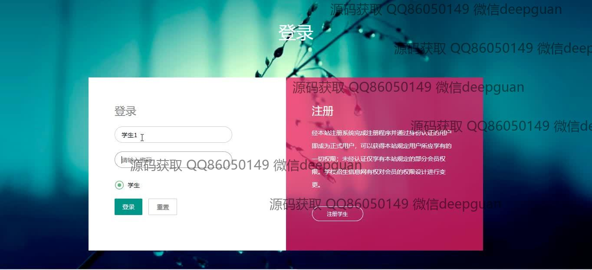
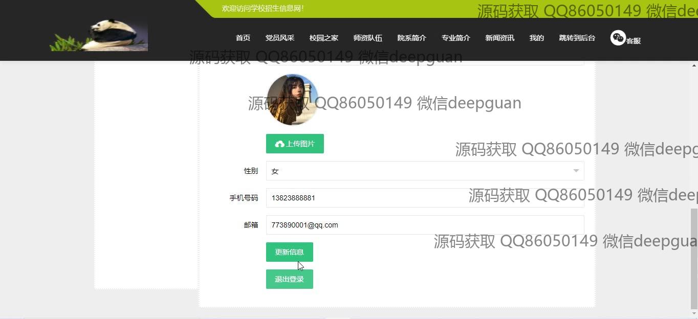

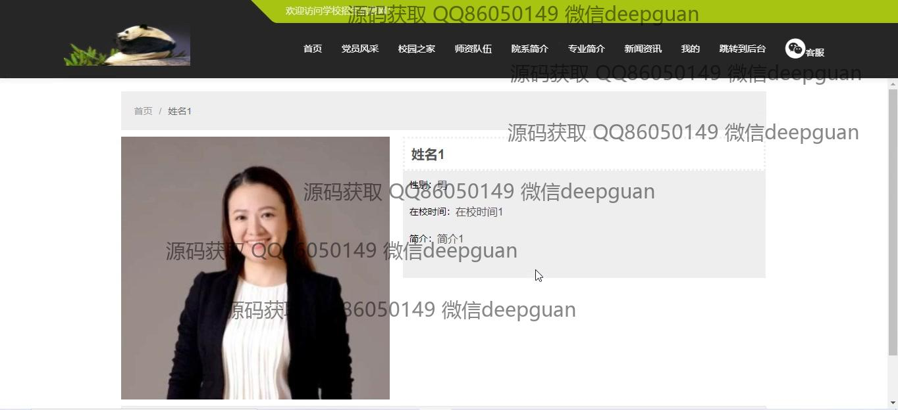
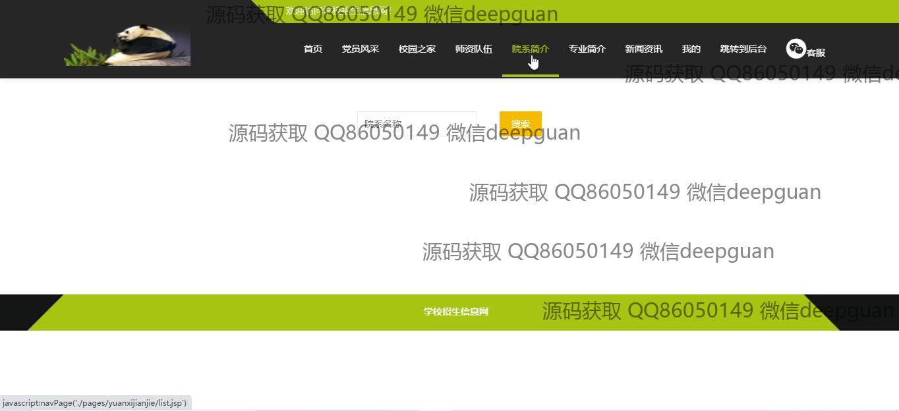
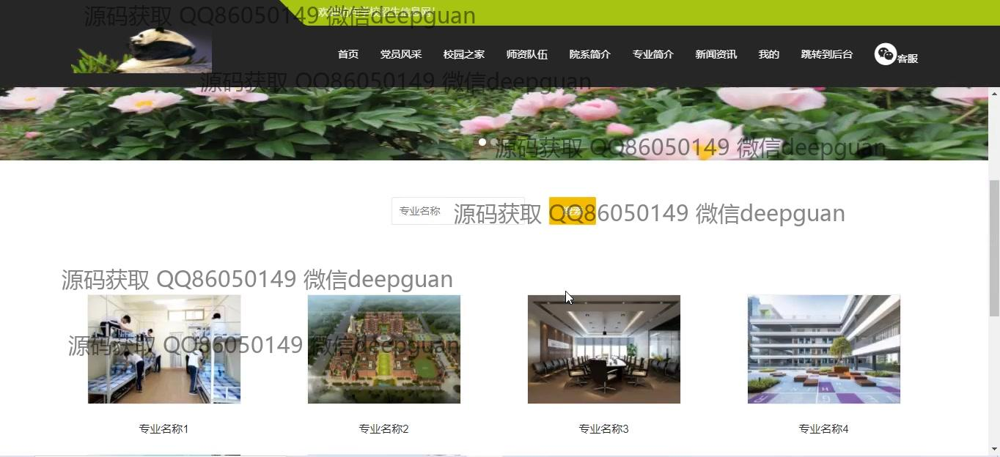
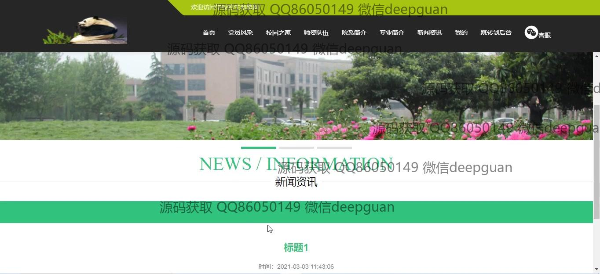
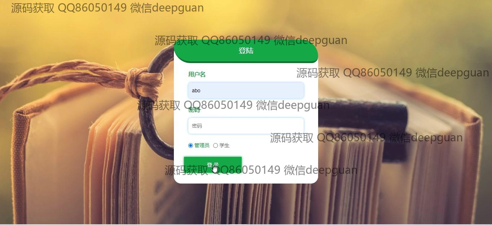
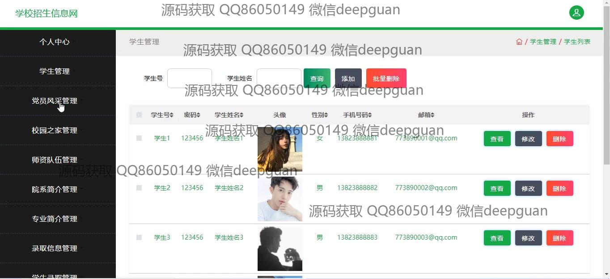
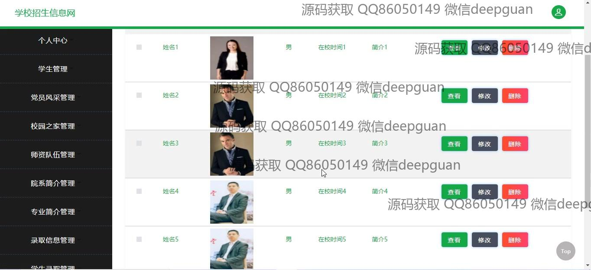
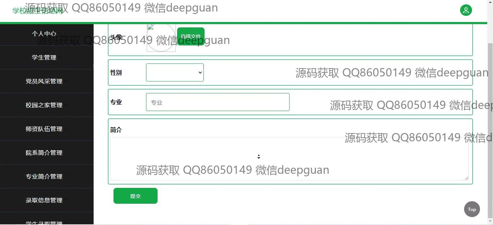
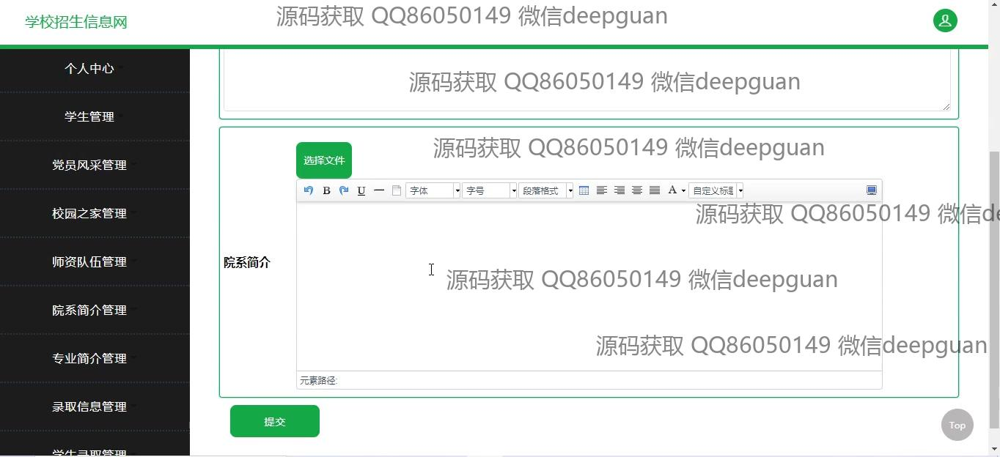
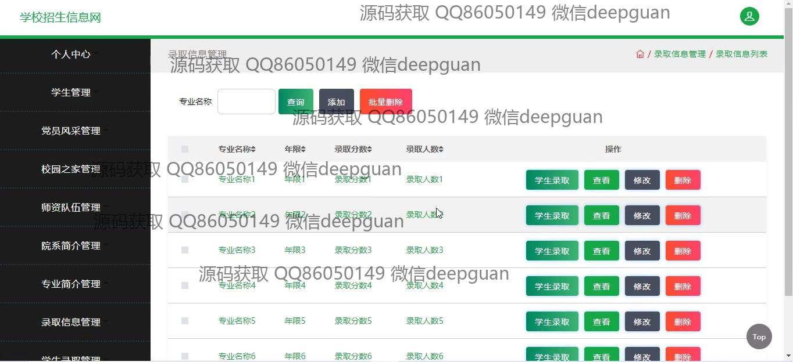
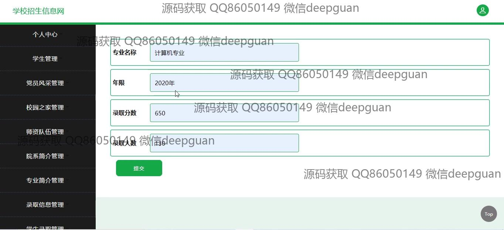
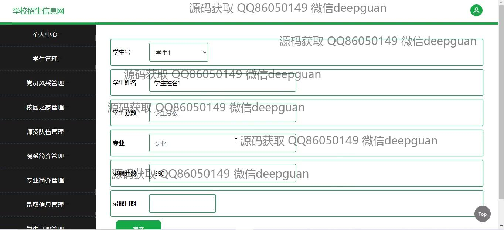
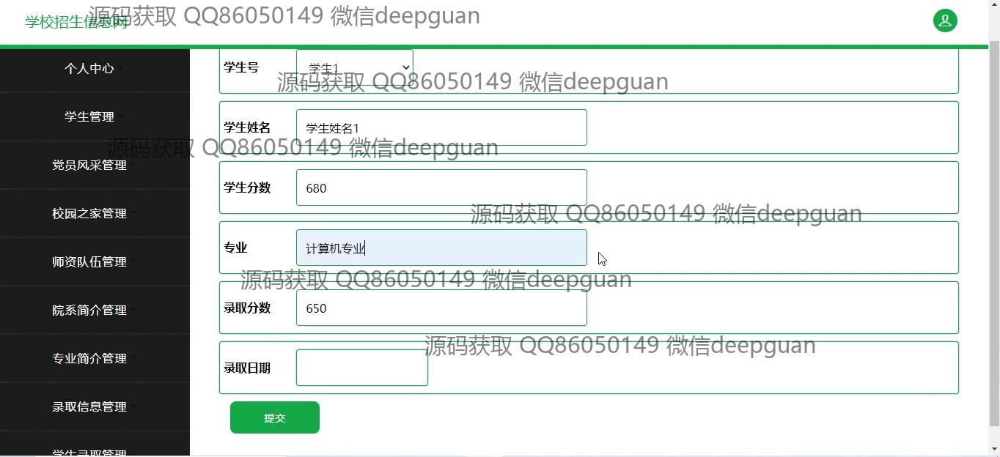
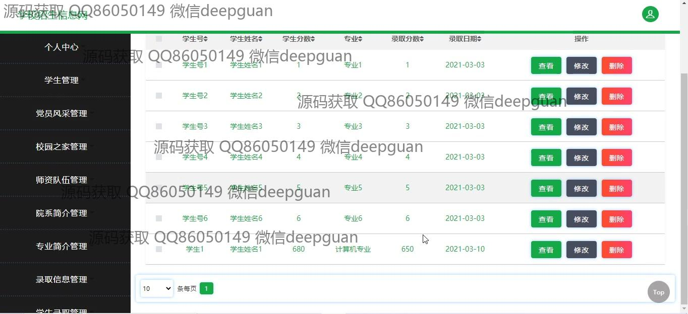
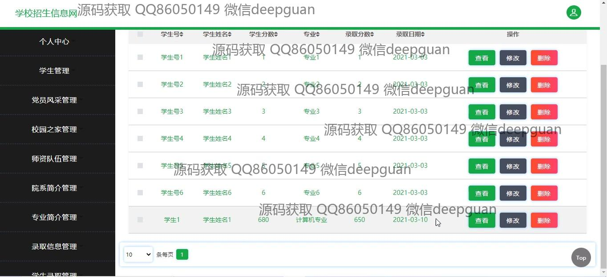
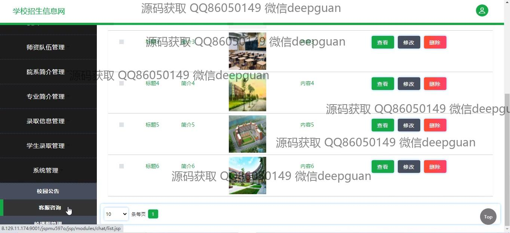
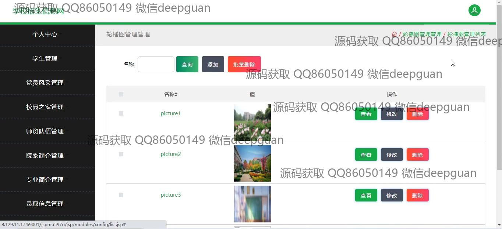
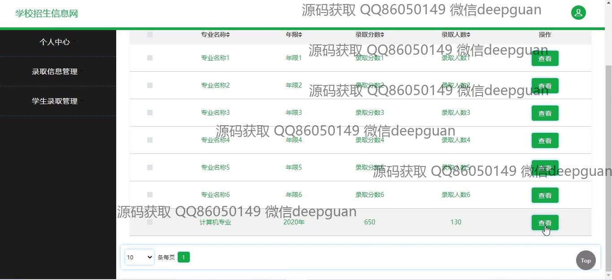
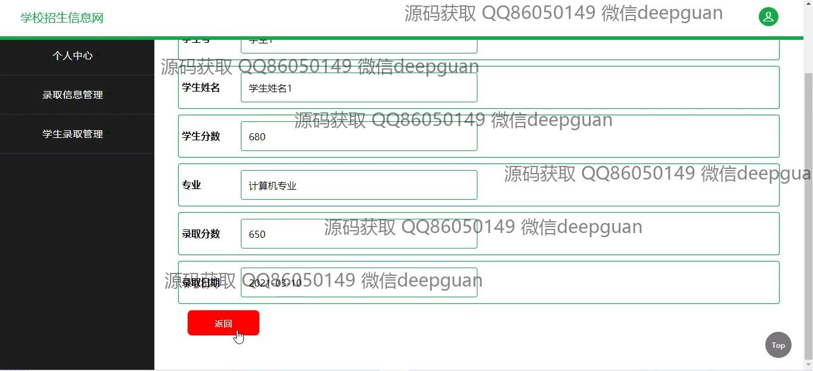

本代码来源于网络,仅供学习参考使用!

